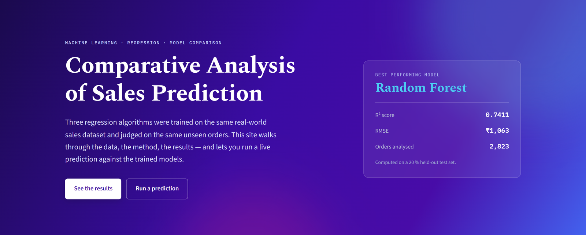
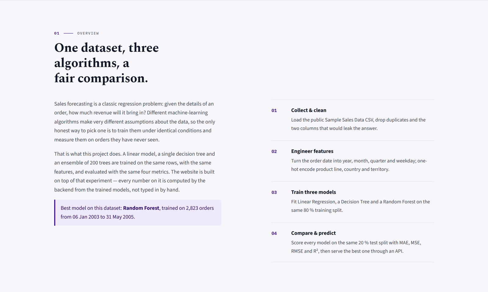
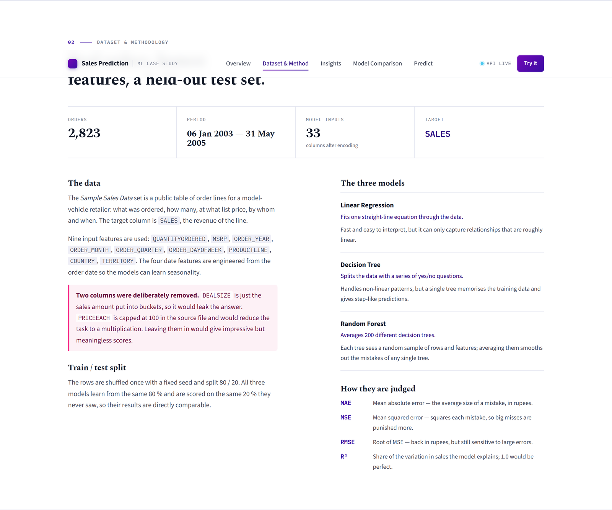
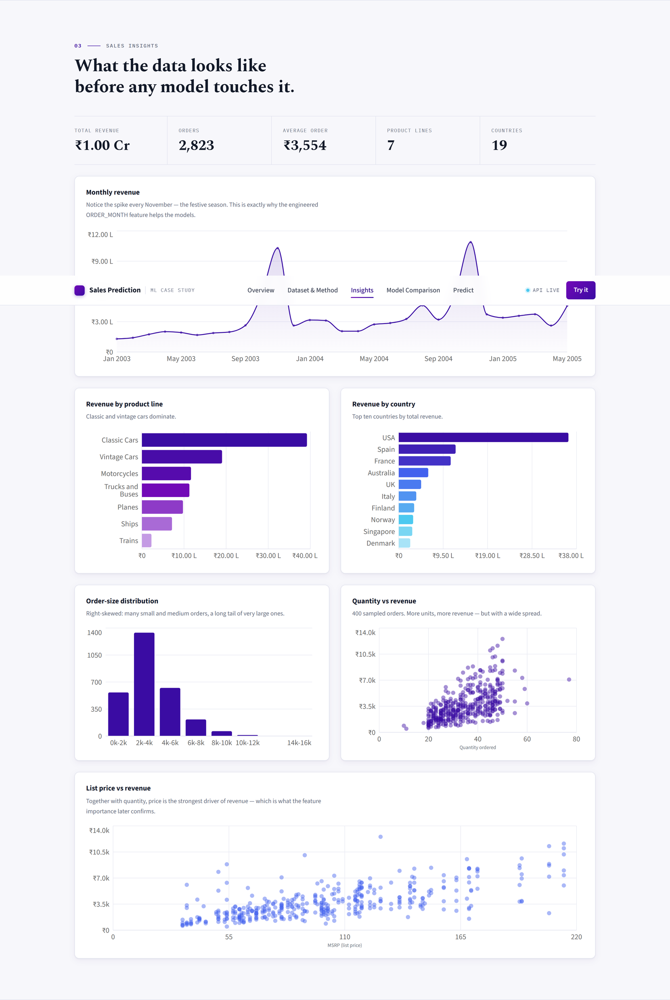
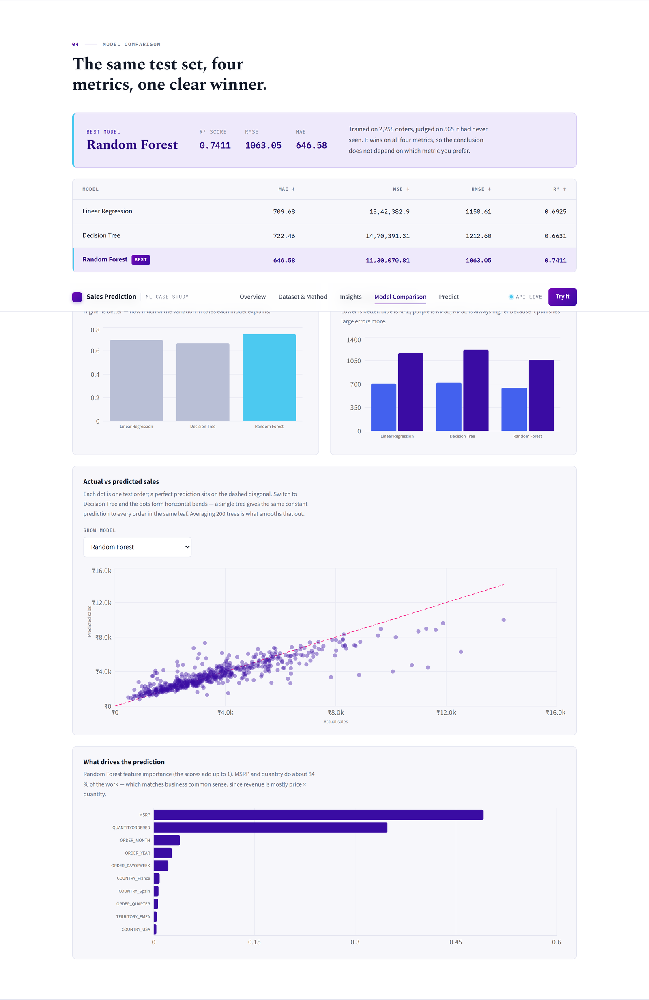
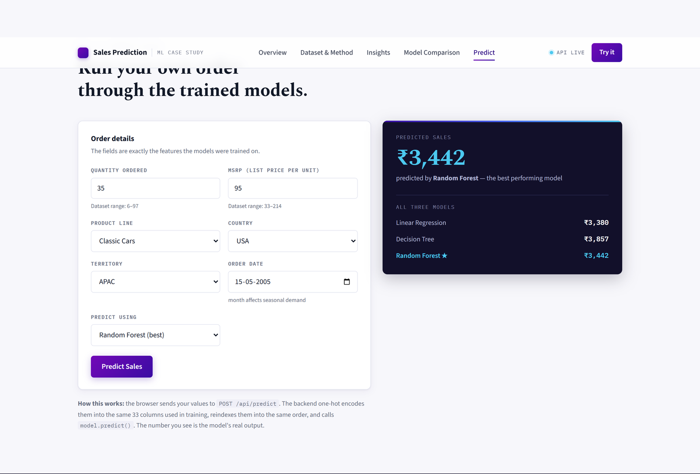

<div align="center">

# 📈 Comparative Analysis of Sales Prediction Using Machine Learning

**A full-stack ML case study that trains three regression models on 2,823 real sales orders, then serves the results — and live predictions — through a public website.**

[](https://sales-prediction-seven.vercel.app/)
[](https://sales-prediction-api-l700.onrender.com/docs)
[](https://www.python.org/)
[](https://react.dev/)
[](https://scikit-learn.org/)

**🔗 [sales-prediction-seven.vercel.app](https://sales-prediction-seven.vercel.app/)** — open it, no install needed

</div>

---

## What this is

Businesses need to know how much revenue an order is likely to generate — guess too high and money sits in a warehouse, guess too low and customers walk away. This project answers a narrower, more honest question first: **when three different machine-learning algorithms are trained on the *same* data and judged on the *same* unseen orders, which one actually wins, and why?**

The answer is computed once by a Python script, saved to disk, and then **served untouched** by a FastAPI backend to a React website — so every chart, table and number you see below is real model output, not a mock-up.

| | |
|---|---|
| 🌐 **Live website** | **https://sales-prediction-seven.vercel.app/** |
| ⚙️ **Live API** | **https://sales-prediction-api-l700.onrender.com** ([interactive docs](https://sales-prediction-api-l700.onrender.com/docs)) |
| 🏆 **Winning model** | Random Forest — **R² = 0.7411**, RMSE ≈ ₹1,063 |
| 📦 **Dataset** | [Sample Sales Data](https://www.kaggle.com/datasets/kyanyoga/sample-sales-data) — 2,823 orders, Jan 2003 – May 2005 |

> ⏳ **First load may take ~30–50 seconds.** The backend is hosted on Render's free tier, which sleeps when idle. The site's **API LIVE** pill turns green once it wakes up — just wait, no need to refresh.

---

## 📸 See it live

<table>
<tr><td width="100%">

### 1 · Hero — the headline result, up front


</td></tr>
<tr><td>

### 2 · Overview — the 4-step pipeline in plain English


</td></tr>
<tr><td>

### 3 · Dataset & Methodology — what went in, and what was deliberately left out


</td></tr>
<tr><td>

### 4 · Sales Insights — the data, before any model touches it


</td></tr>
<tr><td>

### 5 · Model Comparison — same test set, four metrics, one clear winner


</td></tr>
<tr><td>

### 6 · Predict — run your own order through the trained models, live


*This is a real API response — Random Forest, Linear Regression and Decision Tree all scored the same input so you can see exactly how much the three models disagree.*

</td></tr>
</table>

---

## The experiment, in one paragraph

The [Sample Sales Data](https://www.kaggle.com/datasets/kyanyoga/sample-sales-data) set has 2,823 order lines. After restoring a `TERRITORY` value that pandas mis-read as a missing value, dropping three irrelevant address columns, and engineering four calendar features (`ORDER_YEAR`, `ORDER_MONTH`, `ORDER_QUARTER`, `ORDER_DAYOFWEEK`) from the order date, nine predictors were one-hot encoded into **33 model inputs**. Two columns — `DEALSIZE` and `PRICEEACH` — were **deliberately excluded** because they leak the answer (see [why, below](#the-most-important-decision-in-this-project)). The 2,823 rows were split 80/20 (`random_state = 42`); all three models trained on the same 2,258 rows and were scored on the same unseen 565.

## Results

| Model | MAE ↓ | MSE ↓ | RMSE ↓ | R² ↑ |
|---|---:|---:|---:|---:|
| Linear Regression | 709.68 | 1,342,382.90 | 1,158.61 | 0.6925 |
| Decision Tree | 722.46 | 1,470,391.31 | 1,212.60 | 0.6631 |
| **🏆 Random Forest** | **646.58** | **1,130,070.81** | **1,063.05** | **0.7411** |

**Random Forest wins on every metric.** It explains **74.11 %** of the variance in held-out sales and its typical prediction is off by about **₹1,063** against an average order value of **₹3,554**.

<details>
<summary><b>Why Random Forest wins — and why a single Decision Tree doesn't (click to expand)</b></summary>

<br>

- **Random Forest** trains 200 decision trees on slightly different random samples of the data and averages their answers. Each tree's mistakes are a little different, so averaging cancels much of that error out.
- **Linear Regression** comes second with a very respectable score, because sales are roughly `quantity × price`, and a straight line already captures a lot of that. What it can't capture is the *multiplying* effect between the two.
- **A single Decision Tree comes last** — a genuinely useful finding, not a bug. One tree predicts the same constant value for every order that lands in its leaf, producing a "staircase" instead of a smooth prediction (visible in the actual-vs-predicted chart above), and it memorises quirks of the training rows instead of the general pattern.
- **The lesson:** a single tree is *not* automatically better than a simple linear model — it's the *combination* of many trees that wins.

</details>

### The most important decision in this project

Two columns looked like they would boost the score — and were removed on purpose, because using them would have been cheating:

| Column | Why it was excluded |
|---|---|
| `DEALSIZE` | It's literally the sales amount sorted into buckets (Small / Medium / Large). Using it to *predict* sales is circular — it wouldn't exist yet for a genuinely new order. |
| `PRICEEACH` | Capped at 100 in the source file, and for 1,519 of 2,823 rows `SALES = QUANTITYORDERED × PRICEEACH` **exactly**. Keeping it would turn "predict sales" into "do a multiplication," and all three models would score ≈ 1.00 — technically impressive, practically meaningless. |

Removing them lowers every model's score, but makes the comparison honest.

---

## How the pieces fit together

```
 python src/model.py          trains all 3 models ONCE, saves them to
        │                     outputs/results/trained_models.pkl
        ▼
 backend/ml_service.py        LOADS that file — it never retrains
        │
        ▼
 backend/main.py              FastAPI · exposes results as a JSON API
        │   ▲
        │   │  fetch() / POST
        ▼   │
 frontend/src/api.js          the website's only link to the backend
        │
        ▼
 React (Vite) pages           render the KPIs, charts, tables & form
```

Because the website **loads the same saved models** the training script produced, the numbers on the site, in the exported PDF paper, and in `outputs/results/` can never disagree — nothing is typed in by hand.

### Live deployment

| Layer | Technology | Hosted on |
|---|---|---|
| Frontend | React 19 + Vite + Recharts | [Vercel](https://vercel.com) |
| Backend / API | FastAPI + Uvicorn | [Render](https://render.com) (free tier) |
| ML pipeline | pandas · scikit-learn · joblib | Runs once, offline — ships as a `.pkl` |

---

## Tech stack

| | |
|---|---|
| **Language** | Python 3.11 |
| **Data & ML** | pandas, NumPy, scikit-learn, joblib |
| **Visualisation (analysis)** | Matplotlib, Seaborn |
| **Backend** | FastAPI, Uvicorn, Pydantic |
| **Frontend** | React, Vite, Recharts |
| **Alternative dashboard** | Streamlit (`app.py`) |
| **Deployment** | Vercel (frontend) · Render (backend) |

## Machine learning models

| Model | Idea in one line | Configuration used |
|---|---|---|
| **Linear Regression** | Fits one straight-line equation through the data. | `fit_intercept=True` (default) |
| **Decision Tree Regression** | Splits the data with a series of yes/no questions. | `max_depth=8`, `random_state=42` |
| **Random Forest Regression** | Averages 200 different decision trees. | `n_estimators=200`, `max_depth=12`, `random_state=42` |

Evaluated with **MAE**, **MSE**, **RMSE** and **R²** — see [`VIVA.md`](VIVA.md) for what each one means and why R² should never be called "accuracy."

---

## Run it yourself

```bash
# 1. Install dependencies
pip install -r requirements.txt

# 2. Run the full ML pipeline — trains all 3 models, writes graphs + results
python src/model.py

# 3a. Launch the backend API (terminal 1)
python -m uvicorn backend.main:app --reload --port 8000

# 3b. Launch the website (terminal 2)
cd frontend
npm install
npm run dev
```

Then open **http://localhost:5173**. Full troubleshooting steps are in [`RUN.md`](RUN.md).

<details>
<summary><b>Optional: the simpler Streamlit dashboard</b></summary>

<br>

```bash
streamlit run app.py
```

Three tabs: **Sales Trends**, **Model Comparison**, and **Predict Sales**. Run `python src/model.py` first — the dashboard loads the models the script saves; it does not train its own.

</details>

---

## Project structure

```
sales_prediction/
├── dataset/sales.csv                 the raw public dataset
├── notebooks/sales_prediction.ipynb  step-by-step notebook with explanations
├── src/model.py                      the complete ML pipeline, one script
├── outputs/
│   ├── graphs/                       9 EDA & results charts (.png)
│   └── results/                      comparison table, trained models (.pkl)
├── backend/                          FastAPI — main.py (routes), ml_service.py (loads models)
├── frontend/                         React + Vite website (src/sections/*.jsx, api.js)
├── docs/screenshots/                 the images used in this README
├── paper/                            IEEE-format & academic research paper (PDF + source)
├── app.py                            alternative Streamlit dashboard
├── RUN.md                            how to run everything, with troubleshooting
└── VIVA.md                           37 likely viva questions, answered simply
```

## Documentation

| Document | What's in it |
|---|---|
| [`RUN.md`](RUN.md) | Step-by-step setup, ports, and troubleshooting |
| [`VIVA.md`](VIVA.md) | Viva-ready Q&A on the dataset, models and metrics |
| [`paper/`](paper) | A full research paper on this project — both a plain academic format and a proper IEEE two-column conference paper (PDF) |

## Future scope

- **Gradient Boosting / XGBoost** — prior literature on this exact task reports it beats Random Forest.
- **Hyperparameter tuning** via `GridSearchCV` instead of the fixed depth/tree-count used here.
- **Cross-validation** for a more reliable score than a single 80/20 split.
- **Time-series forecasting** (ARIMA / Prophet) to predict *future* monthly totals, not just individual orders.
- **Richer data** — discounts, promotions and marketing spend would very likely push R² well above 0.75.

---

<div align="center">

Built as a machine-learning mini-project · [Live site](https://sales-prediction-seven.vercel.app/) · [API docs](https://sales-prediction-api-l700.onrender.com/docs)

</div>
